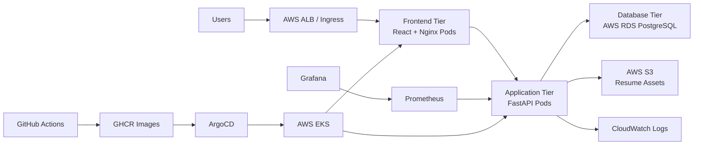

# Architecture

## Three-Tier Architecture



## Folder Structure

```text
.
├── backend
│   ├── app
│   │   ├── api
│   │   ├── core
│   │   ├── db
│   │   ├── models
│   │   ├── schemas
│   │   └── services
│   ├── tests
│   └── Dockerfile
├── frontend
│   ├── src
│   │   ├── api
│   │   ├── components
│   │   ├── pages
│   │   └── styles
│   └── Dockerfile
├── database
│   └── schema.sql
├── infra
│   ├── argocd
│   ├── docker
│   ├── k8s
│   ├── monitoring
│   └── terraform
├── docs
└── .github
```

## Security Model

- JWT bearer authentication for user sessions.
- Admin-only API dependency for management operations.
- RDS encryption enabled.
- S3 public access blocked and server-side encryption enabled.
- Kubernetes secrets are separated from manifests through `secret.example.yaml`.
- CORS origins are environment-configured.

## Scalability Model

- Stateless FastAPI pods behind a Kubernetes service.
- Frontend replicas served by Nginx.
- HorizontalPodAutoscaler for backend CPU demand.
- PostgreSQL hosted on RDS with backup retention and storage autoscaling.
- GitOps deployment through ArgoCD for repeatable rollout and drift correction.
